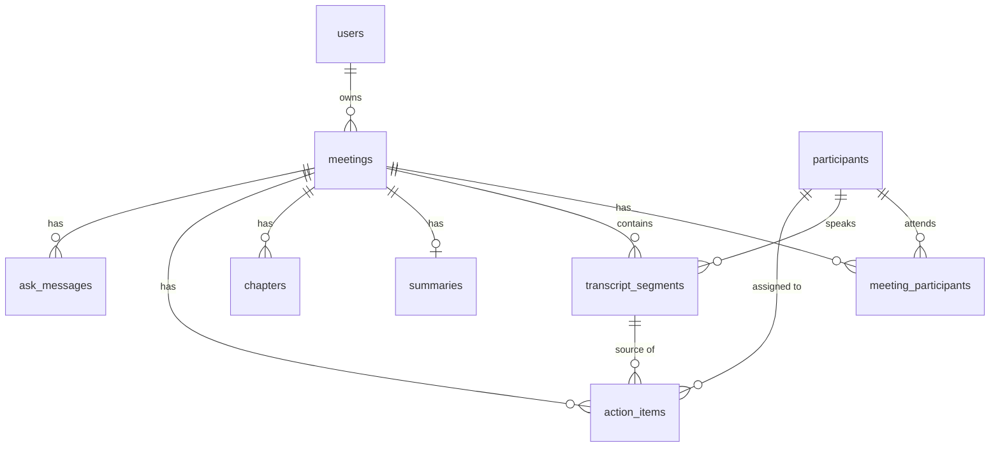

# Fireflies.ai Clone — Meeting Notes & Transcription Platform

A full-stack clone of the Fireflies.ai meeting workspace: a meetings library, an interactive transcript synced to a media player, AI notes (overview, keywords, outline, action items), full CRUD, an "Ask Fred" chat about each meeting, exports and dark mode.

| | |
|---|---|
| **Frontend** | Next.js 15 (App Router) · TypeScript · Tailwind CSS · lucide-react |
| **Backend** | Python 3.11+ · FastAPI · SQLAlchemy 2 · Pydantic v2 |
| **Database** | SQLite (schema below) |
| **AI** | Built-in extractive engine (offline, default) · optional Claude via `ANTHROPIC_API_KEY` |

---

## Features

**Core**
- **Meetings library** — title, date, duration, platform, participants, open action items, keyword chips; grouped by *Today / Yesterday / This week…*; search (title, participant **and transcript text**, with matching snippet), filter by participant(s) and date range, sort (recent, oldest, longest, shortest, A–Z). Filters live in the URL so views are shareable.
- **Meeting detail** — notes panel on the left, transcript on the right, media bar at the bottom.
  - Speaker-labelled, timestamped transcript. **Click a line → player seeks.** **Play / scrub → active line highlights and auto-scrolls** (follow mode toggle; pauses when you scroll manually).
  - Transcript search with highlighted matches, `n / m` counter, Enter / Shift+Enter or arrows to jump between matches; filter by speaker; copy transcript.
  - Player: play/pause, ±15 s, speed (0.75×–2×), seek bar with chapter ticks, and a **per-speaker talk timeline**. Keyboard: Space, ← / →.
- **AI notes** — overview (editable), keywords, outline/chapters (click to seek), action items (click timestamp to seek). Regenerate from transcript at any time.
- **CRUD** — create by **uploading** (`.txt`, `.vtt`, `.json`), **pasting** a transcript, or a **manual form**; edit title/date/participants; delete meeting (cascades); add / edit / complete / delete action items. Everything persists in SQLite.
- **Fireflies experience** — sidebar + top bar layout, Capture menu, modals, dropdowns, toasts for every mutation, skeleton loaders, empty/error states, settings + integrations placeholders.

**Bonus (implemented)**
- **Export** — PDF, Markdown, TXT; with or without transcript.
- **Ask Fred** — chat grounded in the meeting; answers cite clickable timestamps. History persists per meeting.
- **Dark mode** — toggle in sidebar or Settings; no flash on load.
- Extras: Home dashboard, cross-meeting **Action items** page, **Speakers** talk-time analytics, mobile layout.

**Placeholders ("Coming soon")** — live meeting bot, real speech-to-text, integrations (Zoom/Meet/Teams/calendar/CRM), team sharing, AI Apps, analytics, authentication.

---

## Quick start

Requirements: Python 3.11+, Node 18.18+ (20+ recommended).

```bash
# 1) Backend  →  http://localhost:8000  (docs at /docs)
cd backend
python -m venv .venv && source .venv/bin/activate      # Windows: .venv\Scripts\activate
pip install -r requirements.txt
uvicorn app.main:app --reload --port 8000
```
The database is created and **seeded automatically** on first start (6 meetings with full transcripts, summaries, outlines and action items). Reset any time with `python -m app.seed --reset`.

```bash
# 2) Frontend  →  http://localhost:3000
cd frontend
cp .env.example .env.local          # NEXT_PUBLIC_API_URL=http://localhost:8000
npm install
npm run dev
```

Try uploading the files in [`samples/`](samples) (`.vtt`, `.json`, `.txt`) via **Capture → Upload transcript**.

**Tests:** `cd backend && pytest -q` (parser formats, filters, CRUD, upload, ask, export).

### Environment variables

| Variable | Where | Default | Purpose |
|---|---|---|---|
| `NEXT_PUBLIC_API_URL` | frontend | `http://localhost:8000` | Backend base URL |
| `DATABASE_URL` | backend | `sqlite:///./fireflies.db` | SQLAlchemy URL |
| `CORS_ORIGINS` | backend | `http://localhost:3000` | Comma-separated allowed origins |
| `CORS_ORIGIN_REGEX` | backend | — | e.g. `https://.*\.vercel\.app` for preview deploys |
| `SEED_ON_STARTUP` | backend | `true` | Seed when the DB has no meetings |
| `ANTHROPIC_API_KEY` | backend | — | Optional: Claude-generated summaries & answers |
| `LLM_MODEL` | backend | `claude-haiku-4-5-20251001` | Model used when the key is set |

---

## Architecture

```
fireflies-clone/
├── backend/
│   ├── app/
│   │   ├── main.py              # FastAPI app, CORS, lifespan (create tables + seed)
│   │   ├── config.py            # env settings
│   │   ├── database.py          # engine, session, SQLite FK pragma
│   │   ├── models.py            # ORM schema
│   │   ├── schemas.py           # Pydantic API contract
│   │   ├── deps.py              # current_user (default user), meeting_or_404
│   │   ├── routers/             # HTTP layer only — thin
│   │   │   ├── meetings.py      # list/filter, CRUD, upload, transcript search, summary
│   │   │   ├── action_items.py
│   │   │   ├── ask.py           # Ask Fred chat
│   │   │   ├── exports.py       # md / txt / pdf
│   │   │   └── misc.py          # /me, /participants, /health
│   │   ├── services/            # domain logic — no FastAPI imports
│   │   │   ├── meetings.py      # create/update orchestration, serialization
│   │   │   ├── transcript_parser.py  # .txt / .vtt / .json → timed segments
│   │   │   ├── summarizer.py    # overview, keywords, chapters, action items
│   │   │   ├── assistant.py     # question answering over a transcript
│   │   │   ├── exporter.py
│   │   │   ├── llm.py           # optional Claude client with graceful fallback
│   │   │   └── text_utils.py
│   │   ├── seed.py / seed_data.py
│   └── tests/test_api.py
├── frontend/src/
│   ├── app/                     # routes: home, meetings, meetings/[id], tasks, settings, placeholders
│   ├── components/
│   │   ├── layout/              # AppShell, Sidebar, Topbar, CreateMeeting context
│   │   ├── meetings/            # library row, filters, create / edit modals
│   │   ├── meeting/             # header, transcript, player, summary, action items, ask, speakers
│   │   └── ui/                  # Modal, Menu, Toast, Theme, Avatar, ComingSoon
│   ├── hooks/usePlayer.ts       # single playback clock + binary-search active segment
│   └── lib/                     # typed API client, types, formatters
└── samples/                     # example transcripts for upload
```

**Request flow:** React component → `lib/api.ts` (typed fetch, error normalization) → FastAPI router → service → SQLAlchemy → SQLite. Routers validate and translate errors; services hold the logic so they're reusable from the seeder and tests.

**Transcript ↔ player sync.** `usePlayer` owns one clock (`currentMs`). The active segment is found by binary search over segment start times, so it's O(log n) per frame. Every "jump" (line click, chapter, action item timestamp, Ask citation) calls the same `seekTo`. Transcript lines are memoised so only the active line re-renders while playing. Real audio isn't in scope; the clock advances on `requestAnimationFrame`. Swapping in an `<audio>` element only means driving `currentMs` from its `timeupdate` event.

**AI pipeline.** `summarizer.summarize()` tries Claude when `ANTHROPIC_API_KEY` is set (strict JSON output, validated) and falls back to a deterministic extractive engine:
- keywords: frequency ranking with bigram promotion, speaker names excluded;
- overview: top-scored sentences (normalized term frequency), kept in time order;
- chapters: transcript split into ~equal blocks, titled by local keywords;
- action items: commitment/request patterns ("I'll…", "can you…", "by Friday"), meeting-running phrases filtered out, assignee = speaker for commitments, addressed person or next speaker for requests, anchored to the source segment.

"Ask Fred" works the same way: Claude when configured; otherwise intent rules (action items, summary, attendees, topics) plus keyword retrieval that quotes the best transcript lines with timestamps.

---

## Database schema



| Table | Key columns | Notes |
|---|---|---|
| `users` | id, name, email (unique), avatar_color | Single default user (auth out of scope) |
| `meetings` | id, **owner_id → users** (cascade), title, meeting_date, duration_sec, source (`seed/upload/paste/form`), platform, media_url, created_at, updated_at | Index `(owner_id, meeting_date)` for the library query |
| `participants` | id, name (unique), email (unique, nullable), color | People are **shared across meetings**, so filtering "meetings with Maya" and assigning tasks is one join |
| `meeting_participants` | **PK (meeting_id, participant_id)**, role (`host/attendee`), position | N:M association with per-meeting data; cascades on meeting delete |
| `transcript_segments` | id, **meeting_id** (cascade), **speaker_id → participants**, position, start_ms, end_ms, text | Unique `(meeting_id, position)`; index `(meeting_id, start_ms)`. Times in integer ms |
| `summaries` | id, **meeting_id (unique)** (cascade), overview, keywords (JSON), generated_by (`seed/heuristic/llm/manual`), updated_at | 1:1 with meeting |
| `chapters` | id, meeting_id (cascade), position, title, summary, start_ms | Outline anchored to time |
| `action_items` | id, meeting_id (cascade), text, **assignee_id → participants** (SET NULL), **source_segment_id → transcript_segments** (SET NULL), origin (`auto/manual`), due_date, completed, completed_at, created_at, updated_at | Source link powers "jump to moment" |
| `ask_messages` | id, meeting_id (cascade), role (`user/assistant`), content, citations (JSON ms list), created_at | Chat history |

Design choices:
- **Normalized people.** Speakers and attendees reference one `participants` table; segments store `speaker_id`, not a name string, so renaming someone is a single update and talk-time analytics are a `GROUP BY`.
- **Referential integrity is enforced** (`PRAGMA foreign_keys=ON` per connection). Deleting a meeting cascades to segments, summary, chapters, action items and chat; deleting a segment only nulls an action item's source link.
- **Talk time is derived, not stored** (sum of segment durations) so it can't drift from the transcript.
- JSON columns only for small, read-together lists (keywords, citations).

---

## API overview

Interactive docs: `GET /docs` (Swagger) · `GET /redoc`.

| Method | Path | Description |
|---|---|---|
| GET | `/api/health` | Status + whether LLM is enabled |
| GET | `/api/me` | Current (default) user |
| GET | `/api/participants` | People in your meetings, most frequent first |
| GET | `/api/meetings` | List. Query: `q`, `participant` (repeatable, AND), `date_from`, `date_to`, `sort` (`recent·oldest·longest·shortest·title`), `limit`, `offset` |
| POST | `/api/meetings` | Create from JSON: `title`, `meeting_date?`, `participants[]`, `transcript_text?`, `transcript_format?`, `generate_summary?` |
| POST | `/api/meetings/upload` | Create from multipart file (`.txt/.vtt/.json`, ≤ 2 MB) + optional `title`, `participants`, `meeting_date` |
| GET | `/api/meetings/{id}` | Full detail: participants (+ talk time), segments, summary, chapters, action items |
| PATCH | `/api/meetings/{id}` | Update `title`, `meeting_date`, `participants[]`, `platform` |
| DELETE | `/api/meetings/{id}` | Delete (cascades) |
| GET | `/api/meetings/{id}/transcript` | Segments, optional `q` and `speaker_id` filters |
| POST | `/api/meetings/{id}/summary/regenerate` | Rebuild notes from transcript (keeps manual and completed action items) |
| PATCH | `/api/meetings/{id}/summary` | Edit `overview` / `keywords` |
| GET | `/api/action-items` | All action items across meetings (`completed` filter) |
| GET / POST | `/api/meetings/{id}/action-items` | List / create (`text`, `assignee_name?`, `due_date?`) |
| PATCH / DELETE | `/api/action-items/{id}` | Update (`text`, `assignee_name`, `due_date`, `clear_due_date`, `completed`) / delete |
| GET / POST / DELETE | `/api/meetings/{id}/ask` | Chat history / ask a question / clear |
| GET | `/api/meetings/{id}/export?fmt=md\|txt\|pdf&transcript=true` | Download |

Errors use FastAPI's standard shape `{"detail": "..."}` with 404 (not found / not yours), 413 (file too large), 422 (validation or unparseable transcript).

### Supported transcript formats

```text
# .txt — any of these line styles (mixable)
[00:01:23] Speaker Name: text
Speaker Name (00:01:23): text
Speaker Name  00:01:23        ← header line, text on following lines (Fireflies/Otter export)
Speaker Name: text            ← no timestamps: times estimated from speaking pace

# .vtt — WebVTT cues with <v Speaker> voice tags or "Speaker: text"

# .json — [{ "speaker", "start", "end", "text" }]  (seconds, "mm:ss", or start_ms/end_ms)
#          optionally wrapped as { "segments": [...] }
```

---

## Deployment

**Backend → Render** (`render.yaml` included): New → Blueprint → pick the repo. Set `CORS_ORIGINS` to your Vercel URL. Health check: `/api/health`.
> Render's free tier has an ephemeral disk, so the SQLite file resets on redeploy/restart and is re-seeded automatically. Attach a persistent disk and point `DATABASE_URL` at it (e.g. `sqlite:////var/data/fireflies.db`) to keep user changes across deploys. Railway works the same way with a volume.

**Frontend → Vercel:** import the repo, set **Root Directory = `frontend`**, add `NEXT_PUBLIC_API_URL=https://<your-api>.onrender.com`, deploy.

---

## Assumptions & trade-offs

- **No real auth.** Every request acts as the seeded user (`deps.current_user`); all queries are still scoped by `owner_id`, so adding token auth is a change to one dependency.
- **No real audio.** The player is a simulated clock with the full UX (seek, speed, sync). `meetings.media_url` exists for a future real file.
- **Summaries without an API key** are extractive heuristics — deterministic, offline and fast, but less fluent than an LLM. Seeded meetings ship hand-written notes so the demo reflects the intended experience.
- **Search** uses `LIKE` across title, participant names and transcript text, which is fine at demo scale; the next step would be SQLite FTS5.
- Participant identity is by name (case-insensitive). Two different people with the same name would merge; emails could disambiguate.
- Regenerating notes replaces only open, auto-extracted action items (`origin = auto`); items you added or completed are kept.
- UI follows Fireflies' layout and interaction patterns with an original logo mark; no Fireflies assets are used.
